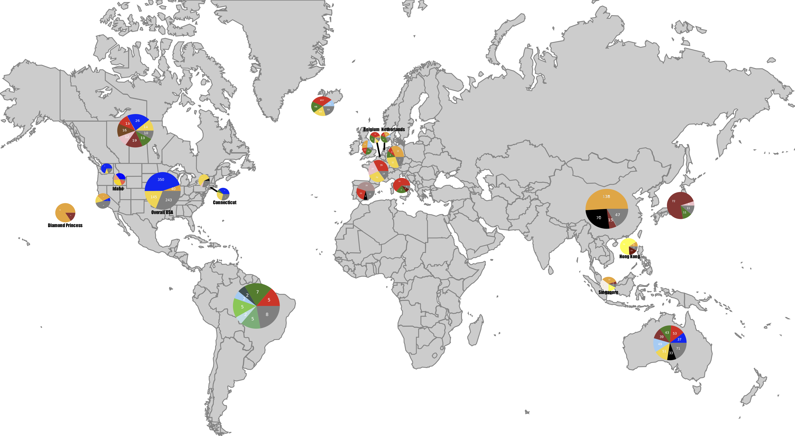

# ISM
Informative Subtype Markers (ISM) is an efficient framework for genetic subtyping of a pandemic virus and implement it for SARS-CoV-2, the novel coronavirus that causes COVID-19.        
Drexel University EESI Lab, 2020        
Maintainer: Zhengqiao Zhao, zz374 at drexel dot edu  
Owner: Gail Rosen, gailr at ece dot drexel dot edu  
###### Latest report is available at [here](ISM-report-20200515-with_error_correction.ipynb)

## Abstract
We utilize an entropy-based analysis to identify mutational signatures of SARS-CoV-2 sequences in the GISAID database available as of April 5, 2020. Our  subtyping method identifies nucleotide sites within the viral genome which are highly informative of variation between the viral genomes sequenced in different individuals. These sites are used to characterize individual virus sequence with a characteristic Informative Subtype Marker (ISM). The ISMs provide signatures that can be efficiently and rapidly utilized to quantitatively trace viral dynamics through geography and time. We show that by analyzing the ISM of currently available SARS-CoV-2 sequences, we are able to profile international and interregional differences in viral subtype, and visualize the emergence of viral subtypes in different countries over time. To validate and demonstrate the utility of ISM-based subtyping: (1) We show the distinct genetic subtypes of European infections, in which early on infections are related to the viral subtypes that has become dominant in Italy followed by the development of local subtypes, (2) We distinguish subtypes associated with outbreaks in distinct parts of the United States, identify the development of a local subtype potentially due to community to transmission and distinguish it from the predominant subtype in New York, suggesting that the outbreak in New York is linked to imported cases from Europe. (3) We present results that quantitatively show the temporal behavior of the emergence of SARS-CoV-2 from localization in China to a pattern of distinct regional subtypes as the virus spreads throughout the world over time.

## Report
We regularly update our report based on the SARS-CoV-2 sequence data from [GISAID](https://www.gisaid.org/) and metadata in [Nextstrain](https://github.com/nextstrain/ncov). You can find the latest version [here](ISM-report-20200515-with_error_correction.ipynb)     


## Reference
Preprint in BioRxiv [Characterizing geographical and temporal dynamics of novel coronavirus SARS-CoV-2 using informative subtype markers](https://www.biorxiv.org/content/10.1101/2020.04.07.030759v2.article-info)
If you found our work to be helpful, please cite:
```
@article {Zhao2020.04.07.030759,
	author = {Zhao, Zhengqiao and Sokhansanj, Bahrad A. and Rosen, Gail},
	title = {Characterizing geographical and temporal dynamics of novel coronavirus SARS-CoV-2 using informative subtype markers},
	elocation-id = {2020.04.07.030759},
	year = {2020},
	doi = {10.1101/2020.04.07.030759},
	publisher = {Cold Spring Harbor Laboratory},
	URL = {https://www.biorxiv.org/content/early/2020/04/09/2020.04.07.030759},
	eprint = {https://www.biorxiv.org/content/early/2020/04/09/2020.04.07.030759.full.pdf},
	journal = {bioRxiv}
}
```
## Acknowledgement
We would like to thank [GISAID](www.gisaid.org) and [Nextstrain](https://github.com/nextstrain) for sharing the sequence data and metadata. We also gratefully acknowledge the authors, originating and submitting laboratories of the sequences from GISAID’s EpiFlu Database on which this research is based. The list is detailed in [here](acknowledgement_table.csv). All submitters of data may be contacted directly via the [GISAID](www.gisaid.org) website.
